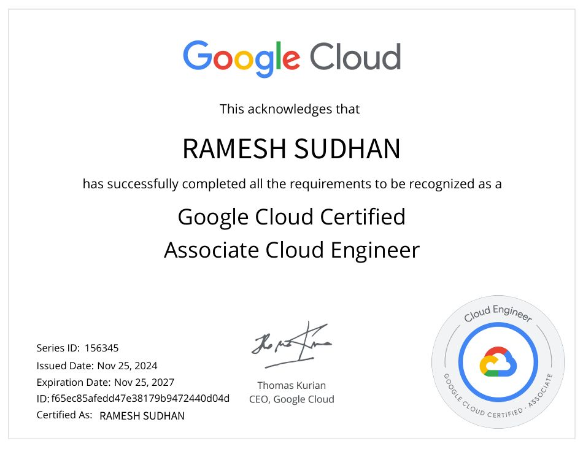

<h1 align="center"> Hi <i>GitHubers!</i> </h1>

<h2 align="center"> This is <h3><b><i>Ramesh Sudhan</i></b></h3></h2>

   <h2 align="center"> 💼 A passionate <b><i>Cloud Engineer</i></b> with a love for building scalable cloud-native solutions. </h2>

  

<h3 align="center"><i>GCP Certificed</i></h3>
<h2> <b>  Open Source Contribution  </b2></h2>

<h3 align="center">Contributed to the <a href="https://github.com/terraform-google-modules/terraform-google-pubsub">Terraform Google Cloud Pub/Sub Module </a>, helping improve infrastructure-as-code for the community.  

 ✦ <a href="https://github.com/terraform-google-modules/terraform-google-pubsub/pull/255">PR255</a> 🔐 Enabled Principle of Least Privilege by making project-level bash "roles/storage.admin" optional via a configuration flag. 

 ✦ <a href="https://github.com/terraform-google-modules/terraform-google-pubsub/pull/255">PR 249</a> 🛠️  Enhanced push subscriptions with support for no-wrapper and write-metadata for better message and metadata control. 

 ✦ <a href="https://github.com/terraform-google-modules/terraform-google-pubsub/pull/255">PR238 </a> ♻️ Enabled dead-lettering in Cloud Storage and BigQuery subscriptions by adding max_delivery_attempts support. 

</h3>

<h2> <b>  Powered by  </b2></h2>

 &nbsp; &nbsp; &nbsp; &nbsp; &nbsp; &nbsp; &nbsp;  

